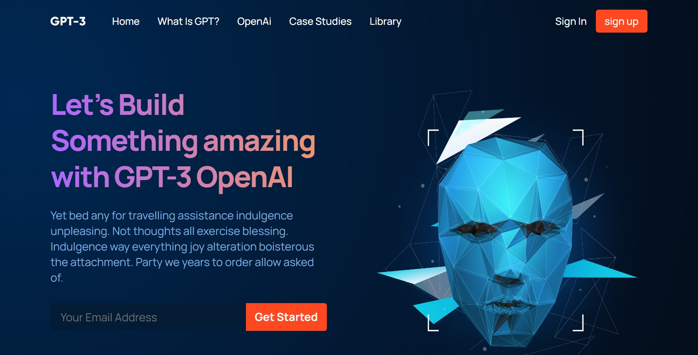
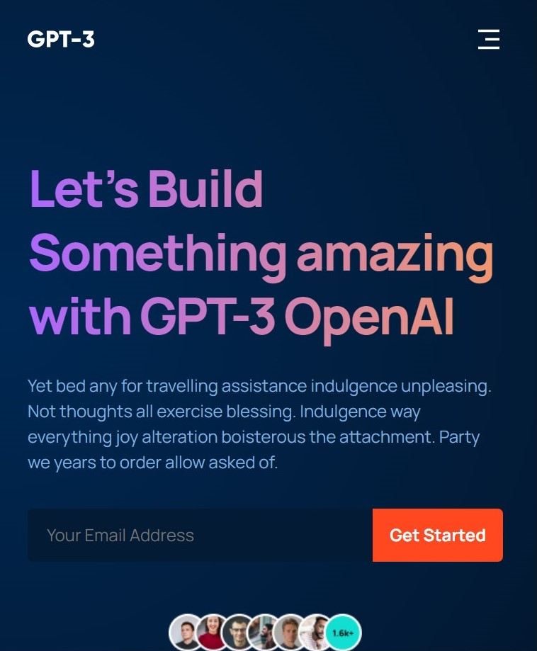

# GPT-3
### GPT-3 is a fully responsive modern ui/ux website built by React JS

## Screenshots 📷

 

 

## Technologies ⚛️
I used `React JS`, `html`, `css`

## Setup / Installation 💻
- download or clone the repository
- run `npm install`
- `npm start`

## Approach
I adopted the `BEM` naming style for my css class names and full responsiveness with pure css.

## Credits 📝
List of contriubutors:

- Eyader Tsehayu(eyaderts@gmail.com)
- [Beginners guide to BEM]
- Adrian Hajdin
- AR Shakir(www.arshakir.com)
